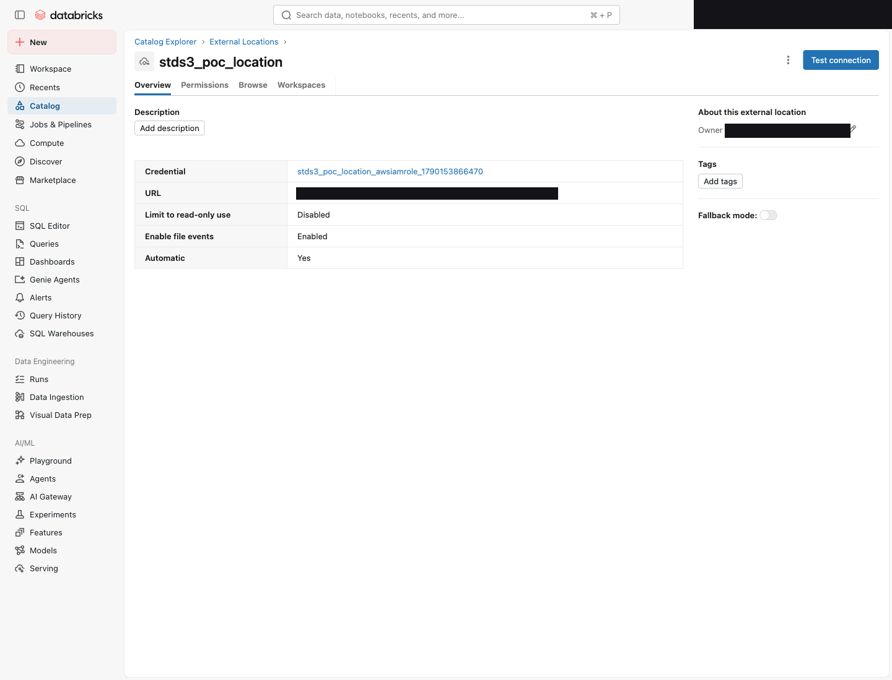
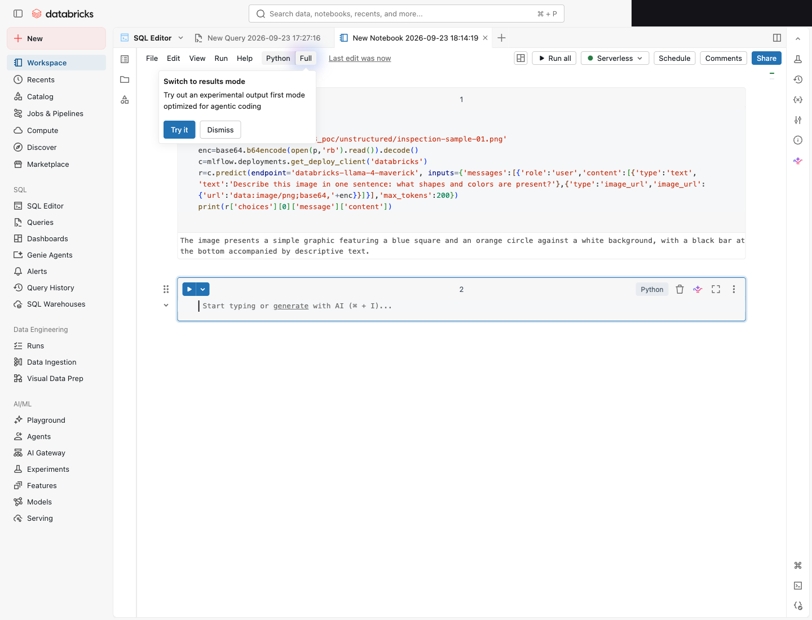
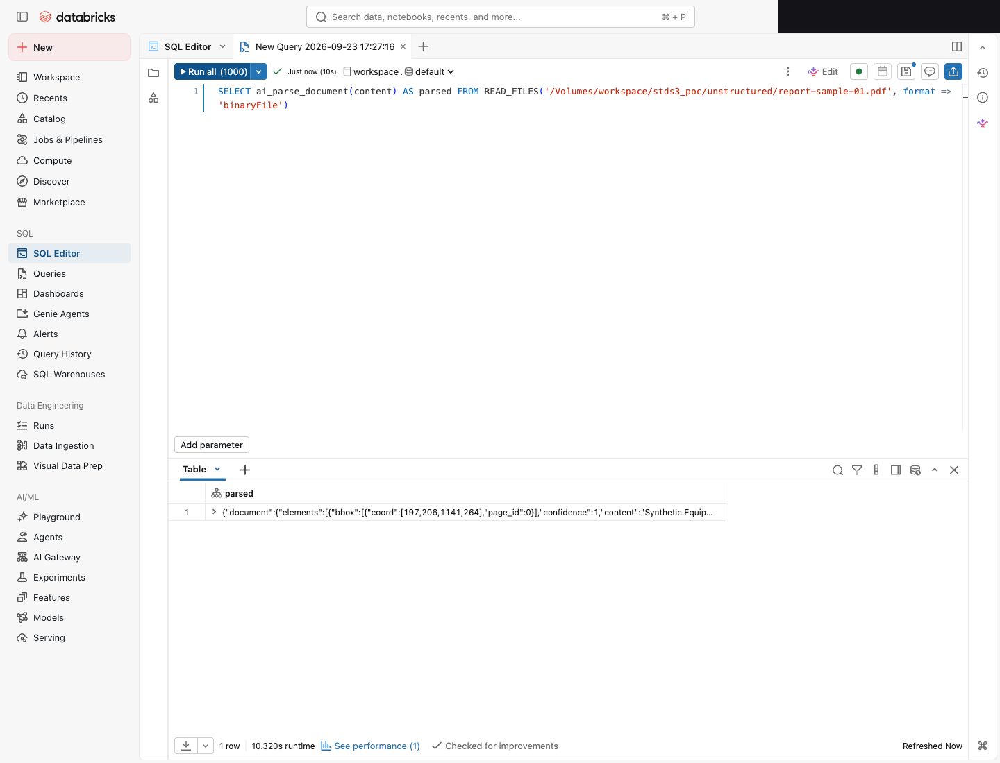
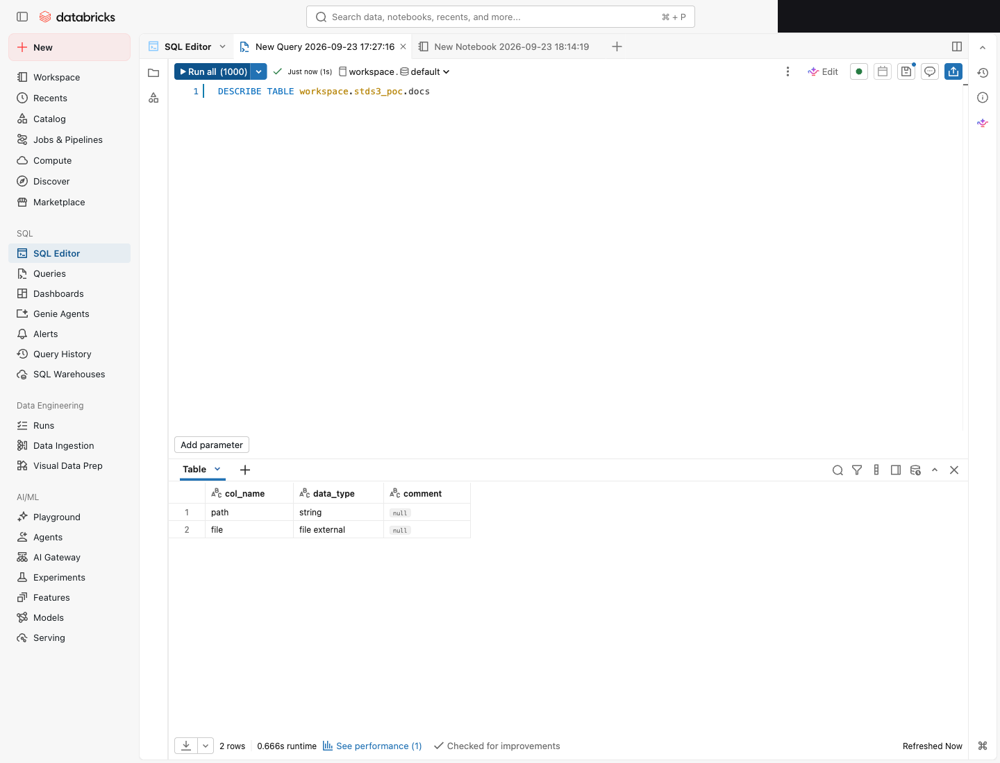
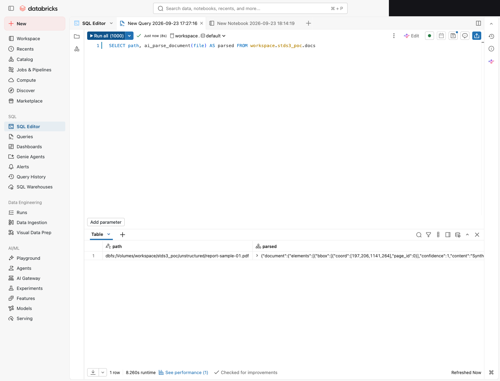
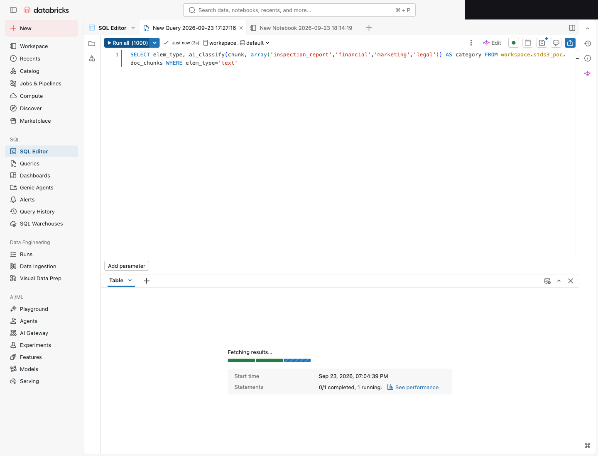
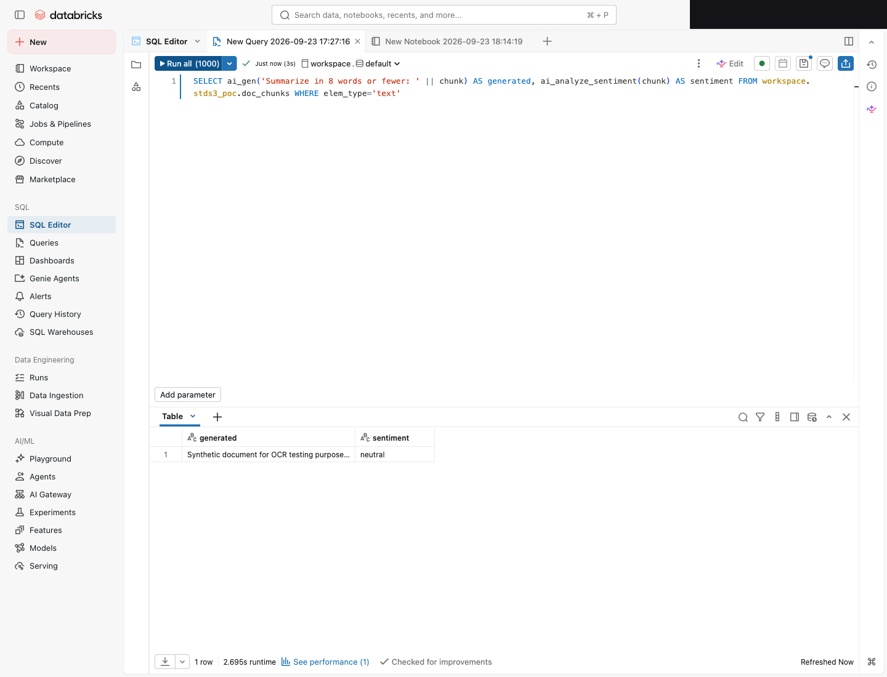
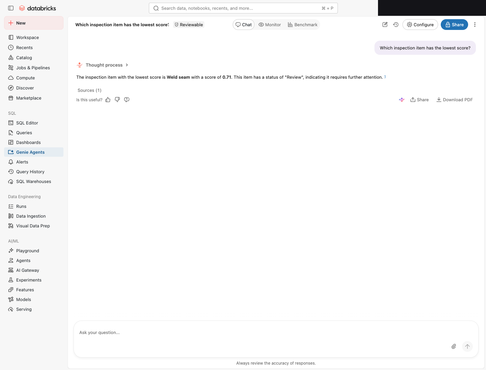

🌐 [English](../en/databricks-standard-s3-unstructured-poc.md) | **日本語**

# 標準 S3 バケット上の Databricks 非構造化データ AI 活用 PoC

> **ステータス**: 実機検証済み（2026-09-23）。6 シナリオ中 5 つを本環境で **Verified**、1 つ（Vector Search）はエンドポイント作成まで Verified・インデックスの ONLINE 化は環境依存の遅延で未完（[検証ステータス](#検証ステータス)を参照）。スクリーンショットはアカウント ID / ワークスペース URL / メールをマスクして掲載。
> **Evidence tier**: 各主張に明記（**Public** = 公開情報で検証可能 / **Verified** = 本環境で実測 / **Project-context** = 内部前提 / **Hypothesis** = 仮説）。
> **検証環境**: Databricks ワークスペース（US リージョン、us-west-2）、Serverless SQL Warehouse（Small、DBSQL channel Current）、標準 S3 汎用バケット（ap-northeast-1、FSx for ONTAP S3 Access Point は使用しない）。合成サンプルのみ（実データ・顧客データなし）。
> **フレーミング**: vendor-versus ではなく right-tool-for-the-job。本リポジトリが推奨する方式の制約も含めて、トレードオフを対称に記載する。
> **このページの位置づけ**: [FILE 型（β）評価](./databricks-file-type-evaluation.md)は FSx for ONTAP **S3 Access Point** 上の挙動を扱い、そこでの推奨暫定経路は「標準 S3 バケットへステージングしてガバナンスする」だった。本ページはその**標準 S3 バケット側で実際に何ができるか**を実機で埋める。S3 Access Point の話ではなく、ステージング先の標準バケットの話である。

---

## エグゼクティブサマリー

- **主題と結果**: データが**標準 S3 汎用バケット**にある前提で、Databricks の非構造化データ AI が実際に動くことを実機で確認した。`ai_query` の LLM Vision、`ai_parse_document` の OCR、FILE 型、AI Functions（`ai_classify`/`ai_gen`/`ai_analyze_sentiment`）、Genie の自然言語問い合わせが標準 S3 上のデータに対して成立した。Vector Search はエンドポイント作成まで成立し、インデックスの ONLINE 化は本環境で時間内に完了しなかった（[検証ステータス](#検証ステータス)）。
- **なぜ標準バケットなら成立するのか**: FSx for ONTAP S3 Access Point 上で非構造化データ AI が [BLK-001](./blocker-tracker.md#blk-001-uc-の資格情報払い出しでは通らない-s3-ap-の読み取り) に阻まれるのは、Unity Catalog が払い出す down-scoped セッションポリシーが**バケット形式 ARN** で書かれる一方、AWS はアクセスポイント経由のリクエストを**アクセスポイント ARN** に対して認可評価するためだった。標準 S3 バケットでは要求もセッションポリシーも同じバケット形式 ARN なので、この不一致が起きない。本環境の UC External Location 検証で Read / List / Write / Delete がすべて Success したことで、これが実測で裏付けられた（[IAM / 認証・認可の挙動](#2-標準-s3-での-iam--認証認可の挙動)）。
- **IAM / 認証観点の所見**: 標準バケットではコア操作（読み書き・AssumeRole・External ID 条件）がすべて通った。唯一 File Events（S3 バケット通知）だけが `s3:GetBucketNotification` 権限不足で Failed になったが、これは任意機能でコア機能をブロックしない。presigned URL はクライアント側の SigV4 計算であり、標準バケットでは `GetObject` として普通に動く。
- **Snowflake との対比**: 同じ「NAS → 標準 S3 → ガバナンス付き AI」を Snowflake Cortex でも実現できる。Databricks の AI Functions は Cortex AISQL 相当、Vector Search は Cortex Search 相当、Genie は Cortex Analyst 相当である（[対比節](#5-snowflake-cortex-との対比)）。どちらが優れているかではなく、既存プラットフォームと用途で選ぶ。
- **推奨する形**: 非構造化データ活用の中核（Vision・OCR・FILE 型・AI Functions・NL 問い合わせ）は、標準 S3 バケット + UC で今日成立する。ガバナンスと AI を Databricks で得たい場合の実務経路である。

---

## 1. アーキテクチャ（標準 S3 を対象とする理由）

**Evidence tier: Public / Project-context。**

本 PoC の実機対象は、合成サンプルを直接置いた**標準 S3 汎用バケット**である。FSx for ONTAP からの現実的な到達経路は下図の左側で、実データ移送は本 PoC のスコープ外（[DataSync → S3 ガイド](./datasync-to-s3-guide.md)に委ねる）。

```
FSx for ONTAP ボリューム（NFS / SMB / S3 Access Point マルチプロトコル）
     │
     │  AWS DataSync（唯一の検証済み同期機構。SnapMirror S3 は FSx for ONTAP で利用不可）
     ▼
標準 S3 汎用バケット  ◀── 本 PoC の実機対象（合成サンプルを直接投入）
     │
     │  UC Storage Credential（IAM ロール）→ External Location → External Volume
     ▼
Databricks Unity Catalog
     ├── ai_query()（LLM Vision / チャット）
     ├── ai_parse_document()（OCR / レイアウト抽出）
     ├── AI Functions（ai_classify / ai_gen / ai_analyze_sentiment）
     ├── FILE 型（FILE EXTERNAL）+ AI 関数
     ├── Mosaic AI Vector Search（embedding → セマンティック検索 / RAG）
     └── Genie（抽出済みメタデータテーブルへの自然言語問い合わせ）
```

> **命名に関する補足**: 図左端は「Amazon FSx for NetApp ONTAP」（以降 FSx for ONTAP）。標準 S3 バケットは Amazon S3 の汎用バケットであり、FSx for ONTAP S3 Access Point とは別物である。両者を混同しないため、本ページで「標準 S3」と書くときは常に Amazon S3 汎用バケットを指す。

---

## 2. 標準 S3 での IAM / 認証・認可の挙動

**Evidence tier: Public / Verified（該当箇所に明記）。**

IAM / 認証の観点で核心となるのはここである — IAM ロール / ポリシー、presigned URL、S3 バケットの認証挙動が、標準バケットでは S3 Access Point とどう違うか。

### 2.1 Databricks が標準 S3 を読むときの認可の連鎖

```
Unity Catalog
  └─ Storage Credential（IAM ロール ARN + External ID）
       └─ AssumeRole 時に Databricks が down-scoped セッションポリシーを生成
            └─ External Location（s3://<standard-bucket>/path を資格情報にマッピング）
                 ├─ External Volume（非構造化ファイル: 画像 / PDF / 音声 / 動画）
                 └─ External Table（表形式データ）
```

IAM ロールは信頼ポリシーで Databricks の Unity Catalog アカウントからの AssumeRole を許可し（`sts:ExternalId` 条件付き、かつロールが自分自身を AssumeRole できる self-assume を含む）、権限ポリシーで対象バケットへの `s3:GetObject` / `s3:ListBucket` などを付与する。Databricks は AssumeRole のたびにセッションポリシーを重ねて、そのセッションでできる操作を対象パスに絞る。

> **Verified（IAM 信頼関係）**: 手動で External Location を作成する際、Databricks は期待する信頼ポリシーを画面に提示する。本環境では **UC マスターロール（`arn:aws:iam::<databricks-uc-account>:role/unity-catalog-prod-UCMasterRole-...`）+ self-assume + `sts:ExternalId` = Databricks アカウント UUID** の形だった（`:root` ではなく特定ロール ARN）。この形に信頼ポリシーを合わせると検証が通る。

### 2.2 標準バケットで BLK-001 が起きない理由

| | 標準 S3 汎用バケット | FSx for ONTAP S3 Access Point |
|---|---|---|
| リクエストの認可評価対象 ARN | バケット形式 `arn:aws:s3:::<bucket>` | アクセスポイント ARN `arn:aws:s3:<region>:<account>:accesspoint/<name>` |
| UC が払い出すセッションポリシーの ARN 形式 | バケット形式 | バケット形式（**同じ**） |
| 一致するか | ✅ 一致する → 読み取り成立 | ❌ 不一致 → `s3:ListBucket` が拒否（BLK-001） |

標準バケットでは、リクエストの評価対象とセッションポリシーの記述がどちらもバケット形式 ARN なので積集合が空にならない。これが「標準 S3 へステージングすれば UC ガバナンス下の AI が成立する」の技術的な根拠である（[BLK-001](./blocker-tracker.md#blk-001-uc-の資格情報払い出しでは通らない-s3-ap-の読み取り)）。

> **Verified（External Location の接続検証）**: 標準バケットに対する UC External Location の作成時、Databricks の接続検証は **Read / List / Write / Delete / Path Exists / Assume Role / Self Assume Role / External ID Condition のすべてで Success** を返した。S3 Access Point で発生する `s3:ListBucket` 拒否（BLK-001）は起きなかった。



> **セキュリティに関する補足**: セッションポリシーは IAM ロール本体のポリシーと積集合を取る。ロールに広い権限を与えても、セッションポリシーが対象パスに絞るため、External Location が指すプレフィックス外へは到達できない。最小権限は External Location のスコープ設計で担保する。

### 2.3 File Events（S3 バケット通知）と最小権限

**Evidence tier: Verified**（本環境の External Location 検証）。

External Location の接続検証で、コア操作がすべて Success する一方、**File Events（S3 バケット通知）の provision だけが Failed** になった。原因は AssumeRole したセッションが `s3:GetBucketNotification` を持たないこと（`no identity-based policy allows the s3:GetBucketNotification action`, HTTP 403）。

- File Events は**任意機能**（取り込み性能の向上・ストレージ一覧コストの削減）であり、無くても読み書きと AI 処理は成立する。「Force create」で先へ進める。
- **IAM 観点の含意**: UC の File Events を使うなら IAM ロールに `s3:GetBucketNotification`（および `PutBucketNotification` など）が必要。読み書き中心の最小権限では File Events が付かず Failed になるが、コア機能はブロックされない。File Events を使うかどうかで必要な IAM 権限が変わる、という設計判断ポイントである。

### 2.4 presigned URL の位置づけ

**Evidence tier: Public**（SigV4 presign の公開仕様と、本検証の §2.5 の観測に基づく）。

presigned URL は**クライアント側の SigV4 署名計算**であり、URL 生成の時点で AWS にリクエストは届かない。生成した URL を使う操作は通常の `GetObject` である。標準バケットでは `GetObject` は当然サポートされるので presigned URL も動作する。

FSx for ONTAP S3 Access Point の互換性表が `Presign` を「Not supported」と記載していても、それは「本番で依存しない」の意であって「失敗する」ではない（同じ理由で `GetObject` を壊さずに presign だけを止めることは構造的にできない）。標準バケットではこの但し書き自体が不要になる。詳細は [FILE 型評価 §4.2](./databricks-file-type-evaluation.md#presigned-url-が動作するのは期待どおり) に記録済み。

### 2.5 CloudTrail による API レベルの裏付け

**Evidence tier: Verified**（本検証中の CloudTrail データイベントログ、2026-09-23）。

上記 2.3 の File Events 失敗と 2.4 の presigned URL の位置づけは、External Location ウィザードの画面表示だけでなく、CloudTrail の記録でも API レベルで裏付けられた。データイベントを記録する Trail のログファイルを解析し、対象バケットと UC ロール（`databricks-uc-stds3-poc`）に一致するレコードを抽出した（アカウント ID / セッション ID / バケット名はマスク）。

**File Events 403 の証跡**: UC のセッション（`arn:aws:sts::<account-id>:assumed-role/databricks-uc-stds3-poc/<session>`）による `GetBucketNotification` が **13 件すべて `AccessDenied`**、`HeadBucket` が **4 件すべて `AccessDenied`** だった。エラー理由は `s3:GetBucketNotification` を許可する identity-based policy が無いこと（HTTP 403）。2.3 の「File Events だけ Failed」は、この 403 が原因だと API レベルで確定する。一方、同じセッションによるデータ面操作（`GetObject` / `HeadObject` / `ListObjects` / `PutObject`）は**拒否されていない**。

**データ面アクセスの主体（presign ではなく AssumeRole）**: 記録された `GetObject` はすべて `userIdentity.type = AssumedRole`、主体は UC ロールだった。presigned URL による GET はクエリ文字列 SigV4 として別主体で現れるはずだが、その形跡は無い。つまり、標準 S3 上の UC は **AssumeRole した資格情報で直接（サーバ側 SigV4 で）**読んでおり、本 PoC の経路では presigned URL を使っていない。これは 共有サーバが SigV4 presigned URL を払い出してクライアントがその URL で読む方式（例: Delta Sharing の credential vending）とは異なる経路である。

**資格情報検証のラウンドトリップ**: External Location 作成時、UC は検証用オブジェクトに対し `PutObject` → `HeadObject` → `GetObject`（後に `DeleteObject` で削除）を実行した。2.2 の「Read / List / Write / Delete / Path Exists すべて Success」は、この一連のデータ面操作が errorCode 無しで記録されたことと一致する。

| CloudTrail イベント | 件数 | errorCode | 意味 |
|---|---:|---|---|
| `GetBucketNotification` | 13 | `AccessDenied` | File Events の provision が 403（2.3） |
| `HeadBucket` | 4 | `AccessDenied` | バケットレベル通知確認の 403 |
| `GetObject` | 5 | なし | データ読み取り成立（すべて AssumedRole） |
| `PutObject` | 1 | なし | 資格情報検証の書き込み |
| `ListObjects` | 23 | なし | 一覧成立 |

> **補足（データイベントの記録範囲）**: S3 のオブジェクト単位イベント（`GetObject` など）は「データイベント」であり、CloudTrail の管理イベント履歴（`lookup-events`）には出ない。上記はデータイベントを記録する Trail のログファイルを直接解析して得た。管理イベントである `GetBucketNotification` は履歴側にも現れる。

---

## 3. 検証シナリオ

各シナリオは「標準 S3 バケットにデータがある前提で、Databricks の非構造化データ AI が何をできるか」を実機で示す。合成サンプル（点検画像 PNG、棒グラフ PNG、点検レポート PDF）を標準バケットの `unstructured/` に置き、UC External Volume として登録して各 AI 機能を適用した。

> **モデル名の実測（Public / Verified）**: 本環境（us-west-2）で pay-per-token として使えたのは `databricks-meta-llama-3-3-70b-instruct`（テキスト）、`databricks-llama-4-maverick`（マルチモーダル）、`databricks-gte-large-en`（embedding）。`databricks-claude-3-7-sonnet` は存在せずエラーだった。pay-per-token の Foundation Model は US リージョンで提供され、Tokyo（ap-northeast-1）ワークスペースには既定エンドポイントが無い（[環境とコスト](#環境とコスト)）。

### 3.1 シナリオ 1: `ai_query()` による画像の LLM Vision（Cortex AISQL 相当）

**Evidence tier: Verified**。

標準 S3 バケット上の画像を UC External Volume から読み、base64 で data URI にして `ai_query`（`databricks-llama-4-maverick`、マルチモーダル）に渡した。合成画像（青い四角・オレンジの円・下部の黒い線）に対し、モデルは "a blue square and an orange circle against a white background, with a black bar at the bottom" と正しく記述した。SQL での messages 構造の手組みは崩れやすかったため、Python ノートブック + `mlflow.deployments` client で実行した。



### 3.2 シナリオ 2: `ai_parse_document()` による PDF OCR（Cortex AISQL 相当）

**Evidence tier: Verified**（10.3s）。

標準 S3 バケット上の PDF に `ai_parse_document()` を適用し、`title`（"Synthetic Equipment Inspection Report"）を bbox `[197,206,1141,264]`・confidence `1`・`page_id 0` 付きで抽出した。段落・表要素も抽出された。



### 3.3 シナリオ 3: FILE 型 + AI 関数

**Evidence tier: Verified**（`ai_parse_document(file)` 8.3s）。

`list_files` で標準バケットのファイルを列挙し、CTAS で `FILE EXTERNAL` 列を持つテーブルを作成した。`DESCRIBE TABLE` は `file` 列の型を **`file external`** と報告した。この `FILE EXTERNAL` 列を `ai_parse_document(file)` に直接渡して OCR に成功した。**S3 Access Point では `FILE EXTERNAL` が BLK-001 でブロックされるが、標準バケット上の UC External Volume では成立する**ことが実証された（本 PoC の対比の核心）。FILE 型のベータ制約（Delta 限定、DBR 18 LTS+、自動 GC なし）は [FILE 型評価 §1](./databricks-file-type-evaluation.md#織り込むべきベータ制約) を参照。





### 3.4 シナリオ 4: AI Functions 一通り（Cortex AISQL 相当）

**Evidence tier: Verified**。

`ai_parse_document` の抽出テキストを持つメタデータテーブルに対し、AI Functions を適用した。

| 関数 | 入力 | 結果 |
|---|---|---|
| `ai_classify(chunk, array('inspection_report','financial','marketing','legal'))` | 抽出テキスト | **inspection_report**（15.0s、初回ウェアハウス起動含む） |
| `ai_gen('Summarize in 8 words or fewer: ' \|\| chunk)` | 抽出テキスト | "Synthetic document for OCR testing purposes."（2.7s） |
| `ai_analyze_sentiment(chunk)` | 抽出テキスト | **neutral** |

Vision（`ai_query`）と OCR（`ai_parse_document`）と合わせ、Cortex AISQL 相当の主要関数（分類・生成・要約・感情・OCR・Vision）が標準 S3 データに対して動作した。





### 3.5 シナリオ 5: Mosaic AI Vector Search による RAG（Cortex Search 相当）

**Evidence tier: Verified（エンドポイント作成まで）/ 環境依存で未完（インデックス ONLINE 化）。**

抽出テキストをチャンク化した Delta テーブル（Change Data Feed 有効）を作り、Vector Search エンドポイント（STANDARD）を作成した（`{'state': 'ONLINE'}` を確認）。続いて Delta Sync Index（embedding モデル `databricks-gte-large-en`、TRIGGERED）の作成を要求したが、**インデックスは約 16 分 `PROVISIONING_ENDPOINT` のまま ONLINE 化せず**、`Delta sync index creation is pending endpoint provisioning.` を返し続けた。トライアル/共有環境での初回プロビジョニング遅延は Databricks コミュニティでも複数報告があり（20 分〜数時間、まれに失敗）、環境依存の挙動である。課金を止めるためインデックス → エンドポイントを削除し、一覧で不在（`endpoints now: []`）を確認した。

> **コストに関する補足**: Vector Search エンドポイントは他の 3 シナリオと課金構造が異なり、常時起動型である。Databricks のドキュメントによれば、エンドポイントは**インデックス作成後に課金され、最後のインデックス削除から 24 時間後に課金が止まる**。撤去してもエンドポイント課金は最大 24 時間残る。また `databricks-gte-large-en` は pay-per-token embedding で高レイテンシであり、初回同期が遅い一因になる。

### 3.6 シナリオ 6: Genie による自然言語問い合わせ（Cortex Analyst 相当）

**Evidence tier: Verified**。

`ai_parse_document` で抽出した点検表を構造化テーブル（`item` / `status` / `score`、テーブルコメント付き）にし、Genie Agent に接続して自然言語で質問した。

- **質問**: "Which inspection item has the lowest score?"
- **Genie の回答**（NL → SQL 自動生成 → 実行 → NL 回答）: "The inspection item with the lowest score is **Weld seam** with a score of **0.71**. This item has a status of 'Review', indicating it requires further attention." → 正答。

「非構造化データを `ai_parse_document` で構造化 → その表に Genie で自然言語問い合わせ」という一連が成立した。これは Snowflake の「`PARSE_DOCUMENT` → Cortex Analyst」と対称である。Genie は SQL ウェアハウス上で動作し、常時起動課金は発生しない。



---

## 4. 対応データ形式

**Evidence tier: Public / Verified（該当箇所に明記）。**

| 形式 | 標準 S3 での取り込み | 適用できる AI | 本環境での実機 |
|---|---|---|---|
| 画像（JPEG / PNG / TIFF） | `read_files` / External Volume / `BINARYFILE` | `ai_query`（Vision）、Vector Search（マルチモーダル embedding） | ✅ Vision を実機（PNG） |
| PDF | `read_files` / FILE 型 | `ai_parse_document`（OCR / レイアウト）、抽出後に AI Functions / Vector Search | ✅ OCR + AI Functions を実機 |
| 音声（WAV / MP3） | `BINARYFILE` / External Volume | 文字起こし UDF / 外部 ASR 経由 | 対応形式として言及（実機せず） |
| 動画（MP4 / MOV） | `BINARYFILE` / External Volume | フレーム抽出 → Vision | 対応形式として言及（実機せず） |

> **補足**: 音声・動画は「取り込み形式として対応」までを示し、AI 処理の実機は画像・PDF を主軸とした（合成またはライセンス明確な公開サンプルのみ使用、実データ・顧客データは使わない）。

---

## 5. Snowflake Cortex との対比

**Evidence tier: Public**（Databricks / Snowflake の公式ドキュメント根拠）。トレードオフは対称に記載する。

同じ「標準 S3 バケット上の非構造化データにガバナンス付き AI を適用する」要件を、Snowflake Cortex でも満たせる。優劣ではなく用途で選ぶ。既存の[Databricks 統合 README](../../integrations/databricks/docs/ja/README.md)と[Snowflake 統合 README](../../integrations/snowflake/docs/ja/README.md)の概念マッピングに接続する。

### 5.1 機能マッピング

Snowflake Cortex は複数機能の総称であり、Databricks 側の対応物も機能ごとに分かれる。「Genie が Cortex 相当」は不正確で、正確には **Genie は Cortex Analyst 相当**である。

| 目的 | Databricks | Snowflake Cortex | 本 PoC での実機 |
|---|---|---|---|
| テキスト AI（分類 / 生成 / 要約 / 感情） | AI Functions（`ai_classify` / `ai_gen` / `ai_analyze_sentiment`） | Cortex AISQL（`CLASSIFY` / `COMPLETE` / `SUMMARIZE` / `SENTIMENT`） | ✅ Databricks 側を Verified |
| 画像 Vision | `ai_query`（マルチモーダルモデル） | Cortex `AI_COMPLETE`（マルチモーダル） | ✅ Databricks 側を Verified |
| ドキュメント OCR | `ai_parse_document` | `PARSE_DOCUMENT` | ✅ Databricks 側を Verified |
| セマンティック検索 / RAG | Mosaic AI Vector Search | Cortex Search | エンドポイント作成まで Verified |
| 自然言語問い合わせ（NL→SQL） | Genie | Cortex Analyst | ✅ Databricks 側を Verified |
| 非構造化ファイルカタログ | UC External Volume / FILE 型 | Directory Table | ✅ Databricks 側を Verified |
| エージェント | Agent Bricks / Mosaic AI Agent | Cortex Agents | 名前のみ言及（常時起動コスト） |
| IAM 参照 | Storage Credential | Storage Integration | ✅ Databricks 側を Verified |
| クラウドパスマッピング | External Location | External Stage | ✅ Databricks 側を Verified |

### 5.2 選び方（right-tool-for-the-job）

- **既に Databricks を使う組織**: 標準 S3 バケットを UC External Location に登録し、`ai_query` / `ai_parse_document` / AI Functions / FILE 型 / Genie でそのまま非構造化データ AI に載せる。本 PoC で一連が動くことを実機確認した。
- **既に Snowflake を使う組織**: External Table + Cortex、または COPY INTO 内部テーブルで同等のことができる（[Snowflake 統合 README](../../integrations/snowflake/docs/ja/README.md)）。
- **両方使う組織**: 標準 S3 バケットをオープン形式（Delta / Iceberg）で持てば、どちらのエンジンからも読める。ストレージを二重に持たず、エンジンを用途で使い分ける。
- トレードオフは対称に: Databricks は Vector Search エンドポイントの常時起動コストと 24 時間課金ルール、pay-per-token の US リージョン制約がある。Snowflake は Vision 用の `TO_FILE` が S3 Access Point 外部ステージで解決できない制約（内部ステージへのコピー回避策が必要）がある。どちらも「その場で全機能が無条件に動く」わけではない。

---

## 検証ステータス

**検証環境**: Databricks（us-west-2）、Serverless SQL Warehouse（Small）、標準 S3 汎用バケット（ap-northeast-1）、合成サンプルのみ。実施 2026-09-23。

### 本環境で検証済み（Verified）

| 主張 | 結果 |
|---|---|
| 標準 S3 バケットで UC External Location 経由の読み書きが成立し BLK-001 に当たらない | Read / List / Write / Delete / Assume / Self-Assume / External ID Condition すべて Success |
| `ai_query` が標準 S3 上の画像に Vision を適用できる | Llama 4 Maverick が図形・色を正しく記述 |
| `ai_parse_document` が標準 S3 上の PDF を OCR できる | title・bbox・confidence を抽出（10.3s） |
| `FILE EXTERNAL` が標準 S3 上の UC External Volume で成立する | `DESCRIBE` が `file external` を報告、`ai_parse_document(file)` 成功（8.3s） |
| AI Functions が標準 S3 データに対して動く | `ai_classify`→inspection_report、`ai_gen`→要約、`ai_analyze_sentiment`→neutral |
| Genie が抽出メタデータテーブルに NL→SQL で回答する | "lowest score?" → "Weld seam 0.71" 正答 |

### 環境依存で未完 / スコープ外

| 項目 | 状態と理由 |
|---|---|
| Vector Search インデックスの ONLINE 化 | エンドポイント作成は Success（ONLINE）。インデックスは約 16 分 `PROVISIONING_ENDPOINT` のまま完了せず。トライアル/共有環境の初回プロビジョニング遅延（Databricks コミュニティで複数報告）。撤去済み |
| File Events（S3 バケット通知）の provision | Failed（`s3:GetBucketNotification` 権限不足）。任意機能でコア機能はブロックしない（[§2.3](#23-file-eventss3-バケット通知と最小権限)） |
| FSx for ONTAP → DataSync → 標準 S3 の実データ移送 | アーキテクチャ図として併記、実送は本 PoC のスコープ外（[DataSync ガイド](./datasync-to-s3-guide.md)） |
| 音声 / 動画への AI 処理の実機 | 実機は画像・PDF を主軸。音声・動画は対応形式としての言及に留める |
| Tokyo（ap-northeast-1）ワークスペースでの AI Functions | pay-per-token の Foundation Model は US リージョン提供。Tokyo ワークスペースには既定エンドポイントが無い |

---

## 環境とコスト

**Evidence tier: Public / Verified / Project-context。**

本 PoC は Databricks トライアルのワークスペース（us-west-2）で実施した。実施して分かった環境・コストの要点:

- **pay-per-token の Foundation Model は US リージョン提供**。Tokyo（ap-northeast-1）ワークスペースには既定の Serving エンドポイントが無く、`ai_query` / `ai_parse_document` はそのままでは呼べない。AI Functions を実機で使うなら US リージョンのワークスペースを選ぶ。
- **Serverless SQL Warehouse（Small、10 分オートストップ）** で AI Functions と OCR/Vision を実行。従量課金で少額。
- **Vector Search はエンドポイント常時起動課金** + **最後のインデックス削除から 24 時間後に課金停止**（Databricks 仕様）。撤去してもエンドポイント課金が最大 24 時間残る。embedding モデル `databricks-gte-large-en` は pay-per-token で高レイテンシ。
- ワークスペース種別・リージョン・ストレージモードによる制約と、支配的コスト（管理 VPC の NAT Gateway、スタック削除では終わらない撤去）は [Databricks 検証環境コスト](./databricks-verification-environment-cost.md) に記録。

---

## FAQ

**Q1. なぜ S3 Access Point ではなく標準 S3 バケットなのか。**

FSx for ONTAP S3 Access Point 上では UC の資格情報払い出し（BLK-001）で非構造化データ AI がブロックされる。標準 S3 バケットではセッションポリシーとリクエストの ARN 形式が一致するため成立する（本環境で Read/List/Write/Delete すべて Success を実測）。本 PoC は「標準 S3 なら何ができるか」を埋めるものであり、S3 Access Point 側の評価は [FILE 型評価](./databricks-file-type-evaluation.md) が扱う。

**Q2. FSx for ONTAP のデータをどう標準 S3 に持ってくるのか。**

AWS DataSync が唯一の検証済み同期機構である（SnapMirror S3 は FSx for ONTAP で利用不可）。本 PoC は実データ移送を行わず、経路を[アーキテクチャ](#1-アーキテクチャ標準-s3-を対象とする理由)として示すに留める。手順は [DataSync → S3 ガイド](./datasync-to-s3-guide.md)。

**Q3. Cortex に相当するのは Genie か。**

いいえ。Snowflake Cortex は複数機能の総称であり、Databricks 側の対応物も機能ごとに分かれる。**Genie は Cortex Analyst（自然言語 → SQL の対話）に相当**する。テキスト/Vision/OCR の Cortex AISQL は Databricks の AI Functions（`ai_query` / `ai_parse_document` / `ai_classify` 等）、Cortex Search は Mosaic AI Vector Search に相当する（[機能マッピング](#51-機能マッピング)）。

**Q4. Snowflake と Databricks のどちらを選ぶべきか。**

用途による。既存のプラットフォーム、必要な AI 機能、コスト構造で選ぶ。[選び方](#52-選び方right-tool-for-the-job)を参照。両方使う場合はオープン形式で標準 S3 に持ち、エンジンを使い分ける。

---

## 参考資料

**Databricks（Public）**
- [Work with unstructured data](https://docs.databricks.com/aws/en/unstructured/) · [AI Functions](https://docs.databricks.com/aws/en/large-language-models/ai-functions) · [Query vision models](https://docs.databricks.com/aws/en/machine-learning/model-serving/query-vision-models)
- [FILE type reference](https://docs.databricks.com/aws/en/sql/language-manual/data-types/file-type) · [Ingest files as the FILE type](https://docs.databricks.com/aws/en/ingestion/file)
- [Create vector search endpoints and indexes](https://docs.databricks.com/aws/en/generative-ai/create-query-vector-search) · [Connect agents to unstructured data](https://docs.databricks.com/aws/en/agents/custom-agents/unstructured-retrieval-tools)

**本リポジトリ**
- [FILE 型（β）評価](./databricks-file-type-evaluation.md) — S3 Access Point 上の挙動と、標準 S3 へのステージング推奨（本ページの対）
- [ブロッカートラッカー](./blocker-tracker.md) — BLK-001（UC 資格情報払い出しと S3 Access Point ARN 形式）
- [Databricks 検証環境コスト](./databricks-verification-environment-cost.md) · [DataSync → S3 ガイド](./datasync-to-s3-guide.md)
- [Databricks 統合 README](../../integrations/databricks/docs/ja/README.md) · [Snowflake 統合 README](../../integrations/snowflake/docs/ja/README.md)
